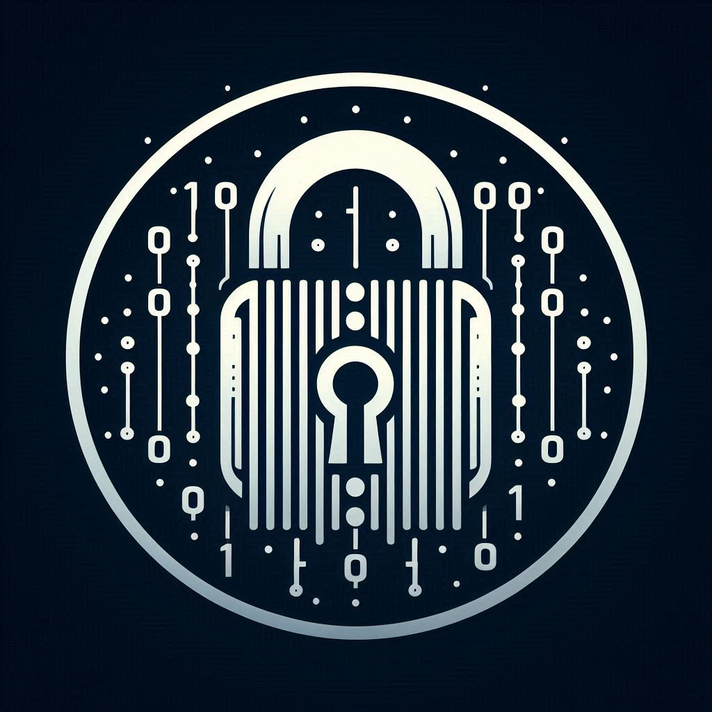

# Text Encryption

This project is designed to encrypt and decrypt user input using various cipher algorithms. It offers two primary modes and three levels of complexity to satisfy different encryption needs. I implimented this projects using <b>[Python](https://github.com/ivin-titus/Text-Encryption/tree/master/text_encryption_python)</b> for Desktop OS and <b>[Flutter](https://github.com/ivin-titus/Text-Encryption/tree/master/text_encryption_flutter)</b> for Smartphones. You're welcome to impliment it on any other languages or use it on your projects. Use algorithm on <b>[Python Edition](https://github.com/ivin-titus/Text-Encryption/tree/master/text_encryption_python)</b> as reference. Don't forget to mention me on such cases.

 

---

### Download Links

<b> <a href="https://github.com/ivin-titus/Text-Encryption/releases/download/apk/Text.Encryption.apk" style="display: inline-block; padding: 12px 24px; font-size: 18px; color: white; background-color: #007BFF; border-radius: 5px; text-align: center; text-decoration: none; font-family: Arial, sans-serif;">
    &#8681; <b>Android</b>
</a></b>

<b> <a href="https://github.com/ivin-titus/Text-Encryption/releases/download/py/text_encryption_python.zip" style="display: inline-block; padding: 12px 24px; font-size: 18px; color: white; background-color: #007BFF; border-radius: 5px; text-align: center; text-decoration: none; font-family: Arial, sans-serif;">
    &#8681; <b>Desktop Edition (Python)</b>
</a></b>
   

---

### Details about this project

#### Modes:

- **Encrypt**: Encode a text using a custom cipher algorithm.
- **Decrypt**: Decode an encoded text.

#### Levels:

- **Simple**: 
    - Requires one key (a number) [ASCII].
    - Suitable for encoding simple text (letters only).
- **Normal**: 
    - Requires two keys (one integer and one string) [ASCII].
    - Suitable for encoding normal text (letters only).
      
- **Advanced**: 
    - Requires three keys (one integer, one string, and one secret key derived from the others) [UNICODE].
    - Suitable for encoding complex text, including special symbols and emojis.

**Note**:
- Simple and Normal levels can only encrypt simple letters and do not encode special symbols or emojis.
- The Advanced level can encrypt any type of text, including special symbols and emojis.
- Use the same keys and levels to ensure correct decoding.
- Key 1 should only have an integer value
- Key 2 should be a String value that only includes alpha-numeric characters (A - Z, a - z, 0 - 9)

 

---

### Detailed Description of Cipher Levels:

#### Simple Level:

- **Encryption**:
  - Converts each character to its ASCII value.
  - Shifts the ASCII value by the provided key (an integer).
  
- **Decryption**:
  - Reverses the shift by subtracting the key from each ASCII value.
  - Converts the ASCII values back to characters.

#### Normal Level:

- **Encryption**:
  - Uses two keys: an integer and a string.
  - Shifts each character's ASCII value by the integer key.
  - Applies a secondary transformation using the string key. 

- **Decryption**:
  - Reverses the string key transformation.
  - Reverses the integer key shift.

#### Advanced Level:

- **Encryption**:
  - Uses three keys: an integer, a string, and a secret key derived from the other two.
  - Converts characters to Unicode values.
  - Applies multiple transformations using all three keys.

- **Decryption**:
  - Reverses the transformations using the same keys.
  
 

---

### Example Usage Scenarios:

1. **Simple Level**:
   - Text: "hello"
   - Key: 3
   - Encrypted Text: "khoor"
   - Decrypted Text: "hello"

2. **Normal Level**:
   - Text: "hello"
   - Keys: 3, "abc"
   - Encrypted Text: "mnoor"
   - Decrypted Text: "hello"

3. **Advanced Level**:
   - Text: "hello 😊"
   - Keys: 3, "abc"
   - Encrypted Text: Complex Unicode string
   - Decrypted Text: "hello 😊"

 

---

### Research and Skills:

- **GUI Development**: Researched and implemented using <b>python packages</b> like `customtkinter` and `pyperclip` for the GUI app on Desktop OS and <b>Flutter</b> for Android and IOS.
- **Object-Oriented Programming**: Enhanced knowledge and skills by structuring the project in an object-oriented manner.
- **Cipher Algorithms**: Gained a deeper understanding of implementing cipher algorithms, which improved problem-solving skills and bridged the gap between ideas and implementation.
- **Testing Methods**: Explored new testing methods to ensure the robustness of the application.

 

---

### Reason of why i re-implimented it on <b>[Flutter](https://github.com/ivin-titus/Text-Encryption/tree/master/text_encryption_flutter)</b>
- Python packages like `customtkinter` and `pyperclip` are mainly made for Desktop OS which have a GUI like MacOS, Ubuntu (or any other linux), Windows etc
- I faced some glitches when i ran it on android using an app called `pyroid`.
- I want everything perfect, so i re-implimented the code on `Dart` - the programming language used on `Flutter` and it have more flexibility on Smartphones  

 

---

### Conclusion:

In the digital age, data protection is paramount. Open communication over the internet poses risks of data breaches. Encryption methods, such as ciphers, are essential for securing data transmission. This project implements a customized version of cipher encryption to enhance data and communication security.

This project demonstrates the application of cipher algorithms to encrypt and decrypt text at different levels of complexity. It highlights the importance of data security in digital communications and offers a practical tool for enhancing privacy and protection. By exploring and implementing various encryption techniques, this project not only provides a functional application but also deepens the understanding of cryptographic principles and their real-world applications.

---
<b> ©️ Ivin Techz 2024</b>
