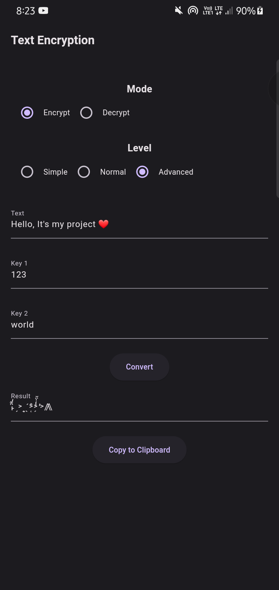

# Cipher Text Converter - Flutter Source Code

### Read <b>[Main Documentation](https://github.com/ivin-titus/Text-Encryption/blob/master/README.md)</b> for more info about this project

### Overview 

This project uses the same algorithm that used on **[Text Encryption - Python](https://github.com/ivin-titus/Text-Encryption/tree/master/text_encryption_python)**, but re-implimented it using Dart. 
Because of some packaging restrictions, it's python edition can't directly run with a GUI on Android or IOS. This is just a source code.   Original apk that can be installed on different android devices is here. I can't give an ios package because i don't  have one      <b> Android: [Download](https://download1321.mediafire.com/nlt9np0h4heghBkA13g8nfw3gsUT9Ox9JPFTXIBNpiXOHXSYt5hZ3uDwMmpcb25pHJ8PEse2QgtLVxJPMnNa13E14i5-ZpLkdt9wg1w14vq65C50TNLhFZDdFj_5JMU6glRzBFyKptz8VvrcqJIl-EnfJ4WfqCyurppyuzYJ0w/npikkymx3hleurt/Text+Encryption.apk)</b>

##

### Demo

<b>©️ Ivin Techz 2024</b>
